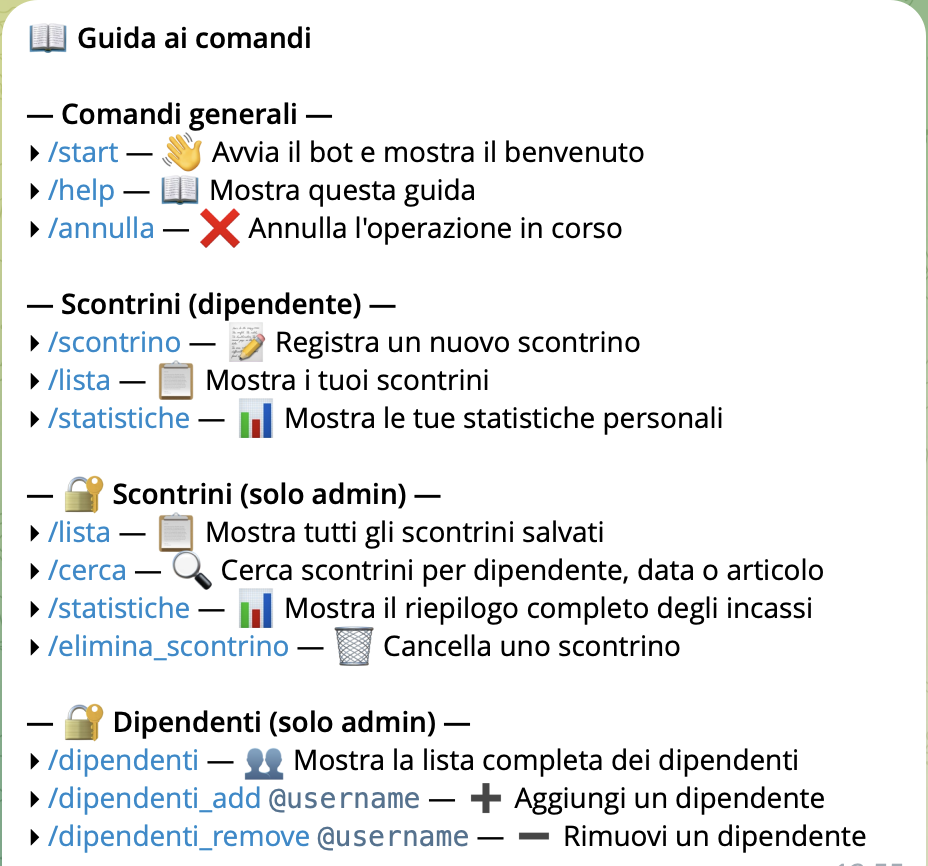
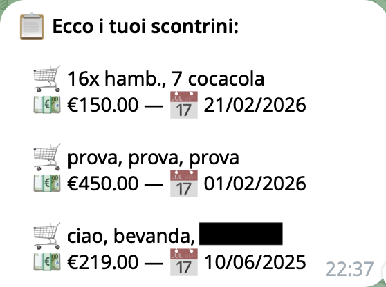
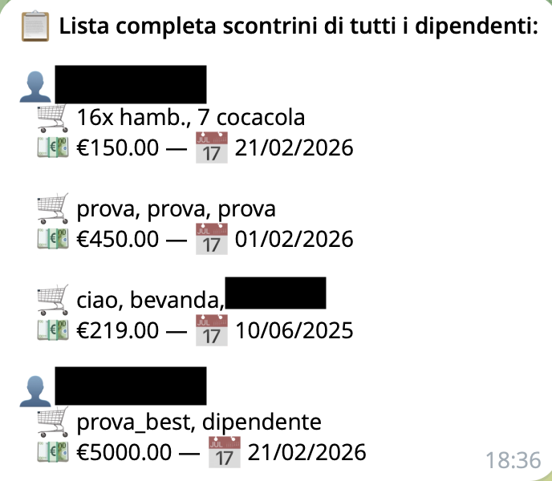
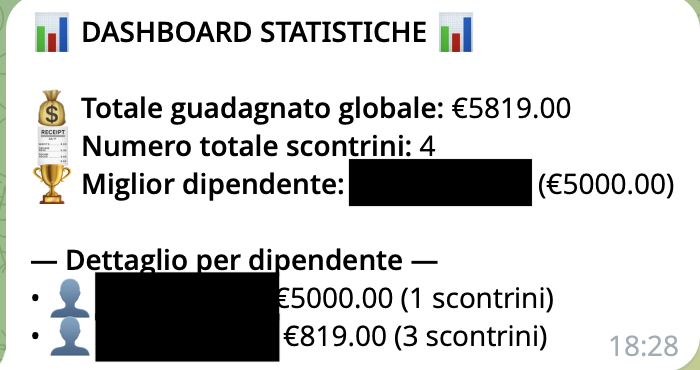

# 🤖 PayDex: Bot Telegram per la Gestione degli Scontrini

> **PayDex** è un bot Telegram sviluppato in Python utilizzando la libreria `python-telegram-bot` (`telegram.ext`) integrato con un **database NoSQL**. Il progetto ha l'obiettivo di gestire la contabilità di base di una ipotetica azienda, la registrazione di scontrini e le statistiche dei dipendenti di un'attività.

### ⚠️ Avvertenza prima di continaure a leggere

> **IMPORTANTE**: Questo BOT Telegram è stato sviluppato **esclusivamente** per scopi di gioco di ruolo e didattici (roleplay). Non è pensato né testato per l'impiego in contesti reali: tutte le attività, gli scontrini e i profili presenti sono **fittizi** e generati per la simulazione.  
> Il progetto nasce principalmente come **esercizio di programmazione** e come opportunità per sviluppare e migliorare le proprie competenze tecniche. Alcune funzionalità sono state inoltre realizzate su **richiesta di utenti all'interno di contesti di roleplay**.   
> L'utilizzo del bot come strumento di monitoraggio effettivo del personale o per la gestione di dati reali **non è raccomandato**.  
> In sintesi: si tratta di un progetto a scopo formativo e ricreativo, progettato per ambienti simulati, e **non adatto all'uso in contesti reali**.

> **Uso previsto**: roleplay / finalità didattiche  
> **Dati**: interamente fittizi, non rappresentativi di persone o aziende reali  
> **Limitazioni**: non idoneo per monitoraggio reale né per utilizzi soggetti a vincoli normativi  
> **Responsabilità**: l'autore non è responsabile per impieghi non conformi a quanto sopra  

## 🎤 Introduzione

> È basato su un sistema a due ruoli (Admin e Dipendenti), differenziando in base all'utente quali comandi e quali dati sono visibili. In allegato è mostrato il comando `/help`, che illustra tutte le funzionalità e i possibili scenari di utilizzo del bot.

## 👥 Ruoli

- **Admin**: Il livello più alto, i loro ID Telegram sono scritti esplicitamente nel file di configurazione. Godono di permessi completi di visione di tutti i dati aziendali e di modifica della lista dipendenti.
    > NB: è possibile aggiunere nuovi **admin** tramite il comando `/add_admin [id_utente]`. Tuttavia, è necessario configurare **almeno un amministratore iniziale** nel file di configurazione affinchè il comando possa essere utilizzato
- **Dipendenti**: Aggiunti dagli admin (`@username`), possono consultare e registrare unicamente i *propri* o quelli concordati. All'inserimento dei dati, un sistema controlla se l'utente che usa il bot si trova in questa lista o in quella admin.

## 🚀 Le Funzionalità nel Dettaglio (Handler)

### 1. Comandi Generali 
- **`/start`**: Invia un messaggio di benvenuto all'utente con una breve descrizione delle funzionalità del bot.
- **`/help`**: Mostra la guida di tutti i comandi disponibili e chiari, divisi per ruolo (Generali, Dipendenti, Admin).
- **`/annulla`**: Ferma bruscamente una conversazione interattiva ("ConversationHandler"), utile nel caso l'utente volesse abbandonare un form d'inserimento.

### 2. Comandi per i Dipendenti (Utenti Regolari)

- **`/scontrino`**: Avvia un form multi-fase per la creazione di una nuova ricevuta.
  1. Verifica dei permessi (se l'utente non è dipendente o admin non può procedere).
  2. Viene mostrata una tastiera da cui scegliere il **nome del dipendente** che effettua la vendita (tra quelli registrati a sistema).
  3. Il bot chiede l'elenco degli **articoli** separati da virgola.
  4. Chiede poi il **prezzo totale**. Elabora formati compatibili (sostituisce la virgola col punto e lo tenta dic convertire in un numero valido) e garantisce non sia negativo.
  5. Chiede la **data**. Consente di scrivere liberamente `"oggi"` (generata in automatico dallo script Python) oppure in formato `dd/mm/yyyy` 
    > Per convenzione e comodità il bot usa il formato data italiano rispetto a quello americano: `yyyy/mm/dd`.
  6. Genera l'oggetto JSON e lo **salva sul Database**, aggiungendolo all'elenco di scontrini di quella specifica persona, per poi stampare un messaggio di riepilogo.

- **`/lista`**: 
  - **Versione Dipendente**: Consulta il database e stampa **esclusivamente i propri scontrini** (carrello, prezzo e data).
  - **Versione Admin**: Consulta il database e stamta **tutti gli scontrini** dei dipendenti che hanno fatto registrato **almeno** uno scontrino e lo stampa diviso in liste

    
  

> Qui sopra presenti i due tipi di liste degli scontrini che vengono stampate, la prima immagine rappresenta tutti gli `scontrini personali`, mentre la seconda immagine stampa `tutti gli scontrini` di ogni singolo dipendente che ne abbia fatto **almeno** uno.  
> **IMPORTANTE:** sono stati censurati gli username dei tester per **privacy**!

- **`/statistiche`**: 
  - **Versione Dipendente**: Stampa il **fatturato personale**, la **quantità totale degli scontrini registrati personalmente** e risponde banalmente "Sì" o "No" nel caso si sia il dipendente col maggior numero di incassi dell'azienda in assoluto.
  - **Versione Admin**: Stampa il **totate guadagnato dall'azienda**, il **numero totale degli scontrini effettuati**, indica il **miglior dipendente** tramite username e guadagno, infine viene inserito un **dettaglio** di ogni singolo dipendente.

    
  

> Qui sopra presenti i due tipi di statistiche che vengono date, la prima immagine `statistiche dipendenti` e la seconda immagine relativa alle `statistiche admin`  
> **IMPORTANTE:** sono stati censurati gli username dei tester per **privacy**!

### 3. Comandi Gestionali per Admin

Tutti i comandi seguenti passano un **Check Admin** iniziale invisibile prima di procedere, bloccando l'esecuzione in caso negativo:

- **`/dipendenti_add [@username]`**: Inserisce e memorizza nel JSON in Firestore un nuovo dipendente fornito per nome utente. Impedisce duplicazioni logiche.
- **`/dipendenti_remove [@username]`**: Trova il dipendente nell'array `usernames` e lo rimuove del database per revocargli gli accessi.
- **`/dipendenti`**: Stampa a visuale di lista tutti gli attuali dipendenti abilitati all'uso del bot.
- **`/add_admin [id_utente]`**: Inserisce un nuovo amministratore in grado di usare tutti i comandi admin.

**Amministrazione Scontrini:**
- **`/lista` (Potenziato per Admin)**: A differenza del dipendente, un admin vede la lista raggruppata per persona di **tutti gli scontrini** aziendali dal database.
- **`/elimina_scontrino`**: Avvia il flow di cancellazione di uno scontrino inviato erroneamente:
  1. Tramite bottoni preleva il nome utente di cui si vogliono esaminare i registri.
  2. Mostra un elenco *numerato* in HTML di tutti gli scontrini appartenenti alla persona indicata.
  3. L'admin invia in chat un **numero indicizzato**, che il bot traduce tramite un `.pop(index)`. L'elenco viene ricaricato e sovrascritto aggiornato su Firestore per il delete.
- **`/cerca [testo/parole multiple]`**: Ottimo tool di controllo combinato globale. Accetta più termini (es `/cerca @mario 01/2026`). Il sistema scarica il database in memoria e restituisce a video tutti gli scontrini (indipendentemente dall'autore) in cui tutti i parametri elencati fanno una corrispondenza (tra articoli, nome venditore e date). Se la lista superasse il limite di telegram (4000 char), taglia il messaggio chiedendo una ricerca più restrittiva.
- **`/statistiche` (Dashboard per Admin)**: L'admin non vede i fatti propri, bensì l'intero andamento fiscale. 
  - **Dati sommati totali globali**: Mostra l'incasso reale e il numero assoluto di vendite registrate da tutti.
  - **Miglior Dipendente**: Trova il top venditore con indicazione dell'incasso massimo.
  - **Dettaglio per Dipendente**: Fornisce una lista *ordinata decrescente* (da chi ha venduto di più a chi meno) di tutti i membri, con incassi personali parziali e numero scontrini. 

## 💕 Ringraziamenti & conclusione

Grazie per aver esplorato **PayDex** — spero che il progetto ti sia utile per il tuo roleplay o come banco di prova didattico. Se trovi bug, hai suggerimenti o vuoi proporre miglioramenti, scrivimi su telegram al seguente bot personale: [@chrisworkshop_bot](https://t.me/theavampi)! 🚀

Ricorda che il bot è pensato per ambienti fittizi; per usi reali è necessario adeguare il codice e la configurazione alle normative vigenti.  
